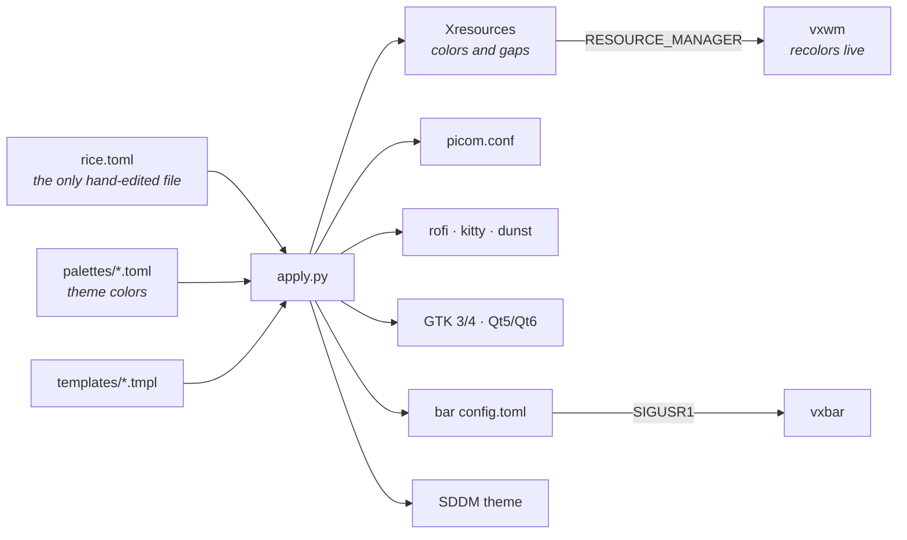

<div align="center">

# Load of Reger

**A tiling X11 desktop: an infinite canvas instead of slide-projector tags,
a Rust status bar, a GTK4 settings app, and a single `rice.toml`
that the whole system unfolds from.**

[](LICENSE)
[](https://archlinux.org)
[](https://github.com/B10Sreg/LoadOfReger/actions/workflows/ci.yml)

[Install](#install) · [NVIDIA](docs/nvidia.en.md) · [Keybindings](docs/keybindings.md) · [How it works](#how-it-works) · [Русский](README.md)

</div>

> The project's code comments and the settings file are written in Russian —
> this page and [docs/nvidia.en.md](docs/nvidia.en.md) are the English entry points.

---

## What it is

A complete environment rather than a pile of configs: two commands to install,
and after the next login everything works — from the greeter to restoring
yesterday's windows.

| Part | What it does |
|---|---|
| **vxwm** (`vxwm-src/`) | A fork of [vxwm](https://codeberg.org/wh1tepearl/vxwm) (itself a dwm fork) with infinite tags. Windows live on one large surface; your monitor is a viewport that slides across it. |
| **vxbar** (`vxbar/`) | Rust + cairo bar: tags, window title, music, network, temperature, CPU, RAM, volume, clock. Clicking a module opens a detail popup. Horizontal and vertical layouts. |
| **vxbar-settings** (`vxbar-settings/`) | GTK4 app for the entire rice — colors, opacity, animations, bar modules, session, power. |
| **rice** (`vxwm/rice/`) | `rice.toml` → Xresources, picom.conf, rofi, kitty, dunst, GTK, Qt, bar colors and the greeter theme. One call, no session restart. |
| **picom** (`picom/`) | FT-Labs build patched against window "teleporting" while sliding tags, plus a watchdog that restarts the compositor when it crashes. |
| **sddm** (`sddm/`) | Login screen theme, recolored together with the rice. |
| **session** (`vxwm/session-*.sh`) | Snapshots open windows and brings them back on the next login. Hibernation brings back browser tabs and unsaved buffers too. |

## Themes

Five themes ship with the rice; each is a single palette in
`vxwm/rice/palettes/` plus a wallpaper.

| Theme | Description | Background | Accent |
|---|---|---|---|
| `carbon` | warm dark gunmetal, bronze accent | `#1c1a18` | `#c9b28a` |
| `abyss` | deep blue-green, turquoise accent | `#0f1a1f` | `#58b8b0` |
| `deep` | deep neutral graphite | `#1e1e20` | `#c0c0c0` |
| `silver` | lightened graphite, polished silver | `#2a2a2d` | `#e2e2e5` |
| `paper` | warm light paper, brown accent | `#edeae4` | `#8a6a3f` |

One palette produces the colors of windows, terminal, menus, notifications,
GTK, Qt and the login screen. `Mod+W` switches all of that at once without
restarting a single program.

## Install

Arch Linux, X11.

```bash
git clone https://github.com/B10Sreg/LoadOfReger.git ~/LoadOfReger
cd ~/LoadOfReger && ./install.sh
```

The installer asks where it is landing — and that answer decides how careful it is:

| Mode | When | What it does |
|---|---|---|
| **`--fresh`** — clean system | Arch is installed, no desktop yet | Installs every dependency, its own configs, the login screen and the rice's keyboard layout (`us,ru`, toggled by Alt+Shift). Asks nothing — you get exactly the desktop from the screenshots |
| **`--existing`** — on top of a configured system | You already have a desktop here | Prints what it is about to touch and asks for confirmation. Then asks per package group (showing what is missing) and before replacing every file that is not its own. Never touches the keyboard layout or the rice's other personal defaults |

The second path is less well tested — the disclaimer says so too. Foreign
`~/.xinitrc`, `~/.xprofile` and the kitty/rofi/dunst/picom configs are saved as
`.bak-<timestamp>` before being replaced, and whatever you declined is listed at
the end together with the manual steps to finish it yourself.

Then log out and back in, picking **vxwm** in the session list.

<details>
<summary>What the installer does</summary>

1. **Packages** — one pacman transaction, six groups: `core` (X11 and
   toolchains), `rice` (kitty, rofi, dunst, feh, slock, xss-lock, the font,
   GTK/Qt themes), `picom` (compositor build deps), `comfort` (zsh with
   completion and highlighting, NetworkManager, PipeWire audio and pavucontrol,
   an emoji font, gvfs with thumbnails, a polkit agent, archivers, clipboard,
   btop/neovim/man), `sddm` (login screen) and `optional` (firefox, thunar,
   flameshot).
2. **paru** — the AUR helper, built from `paru-bin`. An existing paru or yay is
   left alone.
3. **Shell** — zsh becomes the login shell and `~/.zshrc` comes from the repo
   (`zsh/zshrc`: history, menu completion, autosuggestions, syntax highlighting,
   a two-line prompt with the git branch — no oh-my-zsh). NetworkManager is
   enabled and the `~/Downloads`-style directories are created.
4. **vxwm** — builds `vxwm-src/` and installs into `/usr/local/bin`. `config.h`
   is created from `config.def.h` on the first build; an existing one is left
   alone — those are your keybindings.
5. **vxbar** and **vxbar-settings** — built into `~/.local/bin`, with a desktop entry.
6. **picom** — builds the patched version into `~/.local/bin`; your distro
   package stays untouched (`~/.local/bin` simply precedes `/usr/bin` in PATH).
7. **Links** — rice scripts land in `~/.local/bin` as `vxwm-*`, autostart in
   `~/.config/vxwm/autostart.sh`. The clone stays the source of truth: updating
   is `git pull`, not a reinstall.
8. **Session files** — `~/.xinitrc` and `~/.xprofile` become symlinks (existing
   files are saved as `.bak-<timestamp>`); `~/.zprofile` gets a marked block,
   everything else in it is preserved.
9. **Rice config** — copies `rice.toml` into `~/.config/vxwm-rice/` (never
   overwrites an existing one) and expands it into every config.
10. **Login screen** — SDDM theme and a "vxwm" session entry, after a confirmation.

</details>

<details>
<summary>Flags</summary>

```
--fresh           clean system: install everything, ask nothing
--existing        on top of a configured system: confirm every step
--groups LIST     groups to install without asking: core,rice,comfort,picom,sddm,optional
--no-packages     leave pacman alone
--no-picom        skip the patched compositor
--no-sddm         no login manager (startx from tty1 instead)
--no-optional     skip firefox/thunar/flameshot
--no-comfort      skip zsh, networking, audio and the other conveniences
--no-aur          skip paru
--xinerama        build vxwm with multi-monitor support
--list-packages   print the package list and exit
--dry-run         show what would happen, change nothing
-y, --yes         never ask for confirmation
```

</details>

### NVIDIA

Three things need attention on the proprietary driver: `use-damage` in the
compositor, full composition against tearing, and preserving video memory
across hibernation. Step by step: **[docs/nvidia.en.md](docs/nvidia.en.md)**.

Short version: install the driver with KMS enabled, set `use_damage = false` in
`~/.config/vxwm-rice/rice.toml`, run `vxwm-rice-apply`, then follow the doc.

### Update and removal

```bash
cd ~/LoadOfReger && git pull && ./install.sh --existing --no-packages   # update
./uninstall.sh                                             # remove (configs kept)
./uninstall.sh --purge                                     # remove configs too
```

## First five minutes

| | |
|---|---|
| `Mod` + `Return` | terminal |
| `Mod` + `P` | app launcher |
| `Mod` + `W` | switch theme |
| `Mod` + `Shift` + `W` | rice settings |
| `Mod` + `Ctrl` + `H`/`L`/`K`/`J` | move the canvas |
| `Mod` + `Shift` + `F4` | hibernate / shut down |

`Mod` is Alt. Full list: **[docs/keybindings.md](docs/keybindings.md)** (Russian,
but the key tables read fine in any language).

## How it works

One settings file, one generator, no hand-edited configs:



Switching themes restarts nothing: vxwm picks up `RESOURCE_MANAGER` changes,
vxbar re-reads its config on a signal, kitty is recolored over its socket, GTK
watches `gtk.css` itself. Only picom and dunst get restarted — they cannot
re-read their configs.

```
LoadOfReger/
├── install.sh          installer · uninstall.sh — rollback
├── vxwm-src/           the window manager (vxwm fork); config.def.h — keybindings
├── vxwm/               session scripts: autostart, themes, power, session
│   └── rice/           rice.toml, palettes, templates, apply.py, mktheme.py
├── vxbar/              status bar (Rust)
├── vxbar-settings/     settings app (Go + GTK4)
├── picom/              compositor patches and watchdog
├── sddm/               login screen theme
├── x11/                ~/.xprofile and the session entry for the greeter
├── zsh/                zshrc and the zprofile block
└── docs/               NVIDIA, keybindings
```

## Configuration

### rice.toml

`~/.config/vxwm-rice/rice.toml` is the only file you edit by hand (or with the
mouse via `Mod+Shift+W`). The repository copy carries the defaults and a
comment for every key.

```toml
[theme]      name = "carbon"                    # a palette from vxwm/rice/palettes
[windows]    gap = 10 · border = 2              # travel via X resources, live
[compositor] backend · vsync · use_damage       # see docs/nvidia.en.md
             animations · open_animation        # zoom, slide-*, squeeze, fly-in…
             shadow · blur · fading · corner_radius
             bar/window/inactive/terminal/menu_opacity
[session]    restore = true · snapshot_interval = 20
[power]      lock_on_idle = true · idle_seconds = 600
```

Apply with `vxwm-rice-apply` (that is `vxwm/rice/apply.py`); `--theme` does
colors only, `--dry-run` changes nothing.

### Your own theme

```bash
cp vxwm/rice/palettes/carbon.toml vxwm/rice/palettes/mytheme.toml
$EDITOR vxwm/rice/palettes/mytheme.toml          # six UI colors + ANSI palette
cp ~/wall.png vxwm/rice/themes/mytheme/wallpaper.png
vxwm-rice-apply --set-theme mytheme
```

It shows up in the `Mod+W` menu right away.

### The bar

Modules: `tags`, `title`, `layout`, `cpu`, `ram`, `temp`, `net`, `disk`,
`battery`, `volume`, `mic`, `music`, `uptime`, `clock`, `power`. Arrange them
across the three zones in `~/.config/vxbar/config.toml` or in the settings app.
Colors come from the theme — never set them by hand.

### Keybindings and window rules

`vxwm-src/config.def.h` holds keybindings, tags, window rules and the modifier.
After editing:

```bash
./install.sh --existing --no-packages   # rebuilds and reinstalls vxwm
```

The first build copies `config.def.h` to `config.h`; from then on the installer
only updates the defaults file and leaves your `config.h` alone. WM features
themselves (infinite tags, gaps, tag-slide animation) live in
`vxwm-src/modules.def.h`.

### Hibernation

The primary way to leave a session: browser tabs and unsaved buffers survive.
It needs swap the size of your RAM, so it is a separate step — the script
touches `fstab`, kernel parameters and the initramfs:

```bash
sudo bash vxwm/hibernate-setup.sh                      # swapfile on /
sudo bash vxwm/hibernate-setup.sh /mnt/data/swapfile   # or another disk
```

It detects your GPU and configures NVIDIA so that hibernation actually comes
back (see [docs/nvidia.en.md](docs/nvidia.en.md#4-hibernation)).

## What it does not do

An honest list, so you don't find out after installing:

- **Arch only.** Elsewhere the installer refuses and prints the package list
  (`./install.sh --list-packages`); a manual install is possible, but
  `picom-ftlabs` and `slock` still have to be built from source.
- **Multiple monitors** need `./install.sh --xinerama`. Without it vxwm treats
  every screen as one. Multi-monitor is not well tested in this fork.
- **Audio goes through PipeWire.** Volume and microphone, both in the bar and on
  the Fn keys, drive `wpctl`. On plain PulseAudio or ALSA those modules stay silent.
- **Hibernation** means a swapfile on ext4/xfs with GRUB. On btrfs the script
  refuses outright; on systemd-boot it prints the kernel parameters for you to add.
- **`--existing` is less tested than `--fresh`.** The rice targets a clean
  system; on a configured one it asks and makes backups, but it cannot foresee
  every conflict (your own compositor, your own login manager).
- **Personal defaults.** `us,ru` keyboard layout toggled by Alt+Shift
  (`[input]` in `rice.toml`, never set in `--existing` mode) — note that Alt+Shift
  overlaps with vxwm's bindings, since `Mod` is Alt here, so every `Mod+Shift+…`
  also flips the layout; alternatives are listed next to the setting. `refreshrate = 144`, firefox
  pinned to tag 2, `Mod+A` launching `ollama run llama3` (ollama itself is not
  installed). All of it is a couple of lines in `vxwm-src/config.def.h` and
  `rice.toml`.
- **NVIDIA** works but needs the setup in [docs/nvidia.en.md](docs/nvidia.en.md)
  that amdgpu does not.

## Troubleshooting

| Symptom | Where to look |
|---|---|
| Blank screen after login | `~/.xsession-errors`; did `~/.config/vxwm/autostart.sh` run? |
| No bar | is `vxbar` in `~/.local/bin`, and is that directory in `PATH`? |
| Shadows, transparency and animations gone | picom crashed — `coredumpctl list \| grep picom`; the watchdog restarts it and notifies |
| Flicker, window ghosts (NVIDIA) | [docs/nvidia.en.md](docs/nvidia.en.md#2-picom-turn-use-damage-off) |
| Login screen not recolored | the greeter theme needs root: `sudo bash sddm/install.sh` |
| Qt apps kept the old colors | Qt reads the palette at startup — restart the window |
| Last session's windows did not return | the `~/.config/vxwm-rice/no-session-restore` flag, or `[session] restore = false` |

## Credits

- [wh1tepearl](https://codeberg.org/wh1tepearl/vxwm) — vxwm and infinite tags;
- [suckless.org](https://suckless.org) — dwm and slock, where this started;
- [FT-Labs/picom](https://github.com/FT-Labs/picom) — the compositor with animations.

## License

MIT — see [LICENSE](LICENSE). Files under `vxwm-src/` keep the vxwm and dwm
licenses (`vxwm-src/LICENSE`, `vxwm-src/LICENSE.dwm`).
