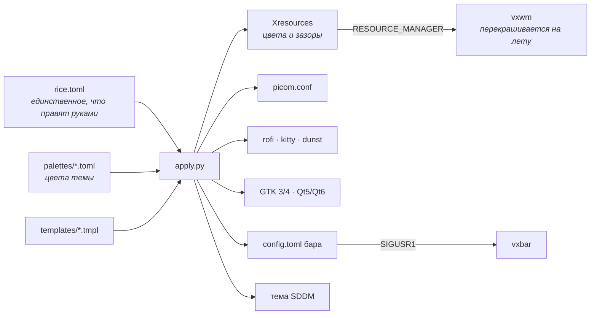

<div align="center">

# Load of Reger

**Тайловый рабочий стол на X11: бесконечный холст вместо тегов-слайдов,
свой бар на Rust, приложение настроек на GTK4 и один `rice.toml`,
из которого разворачивается вся система.**

[](LICENSE)
[](https://archlinux.org)
[](https://github.com/B10Sreg/LoadOfReger/actions/workflows/ci.yml)

[Установка](#установка) · [NVIDIA](docs/nvidia.md) · [Хоткеи](docs/keybindings.md) · [Как устроено](#как-это-устроено) · [English](README.en.md)

</div>

---

## Что это

Готовое окружение, а не набор конфигов: ставится двумя командами и после
перезахода работает целиком — от экрана входа до восстановления вчерашних окон.

| Часть | Что делает |
|---|---|
| **vxwm** (`vxwm-src/`) | Форк [vxwm](https://codeberg.org/wh1tepearl/vxwm) (сам он — форк dwm) с бесконечными тегами. Окна лежат на общей поверхности, монитор — окошко, которое по ней ездит. |
| **vxbar** (`vxbar/`) | Бар на Rust + cairo: теги, заголовок, музыка, сеть, температура, CPU, RAM, звук, часы. Клик по модулю открывает окошко с подробностями. Горизонтальный и вертикальный режимы. |
| **vxbar-settings** (`vxbar-settings/`) | GTK4-приложение: весь рис мышью — цвета, прозрачность, анимации, модули бара, сессия, питание. |
| **rice** (`vxwm/rice/`) | `rice.toml` → Xresources, picom.conf, rofi, kitty, dunst, GTK, Qt, цвета бара и тема экрана входа. Одним вызовом, без перезапуска сессии. |
| **picom** (`picom/`) | Сборка FT-Labs с патчем против «телепорта» окон при листании тегов + сторож, который поднимает композитор после падения. |
| **sddm** (`sddm/`) | Тема экрана входа, перекрашивается вместе с рисом. |
| **сессия** (`vxwm/session-*.sh`) | Снимок открытых окон и их возврат при следующем входе. Плюс гибернация — с ней возвращаются и вкладки, и несохранённое. |

## Скриншоты

> Положи сюда свои: `docs/screenshots/`. Пять тем идут в комплекте, все —
> с обоями и общей палитрой.

| Тема | Описание | Фон | Акцент |
|---|---|---|---|
| `carbon` | тёплый тёмный ганметал с бронзовым акцентом | `#1c1a18` | `#c9b28a` |
| `abyss` | глубокая сине-зелёная с бирюзовым акцентом | `#0f1a1f` | `#58b8b0` |
| `deep` | глубокий нейтральный графит | `#1e1e20` | `#c0c0c0` |
| `silver` | осветлённый графит с полированным серебром | `#2a2a2d` | `#e2e2e5` |
| `paper` | светлая тёплая бумага с коричневым акцентом | `#edeae4` | `#8a6a3f` |

Тема — это одна палитра из `vxwm/rice/palettes/`. Из неё получаются цвета окон,
терминала, меню, уведомлений, GTK, Qt и экрана входа: `Mod+W` — и всё это
меняется разом, не перезапуская ни одной программы.

## Установка

Arch Linux, X11.

```bash
git clone https://github.com/B10Sreg/LoadOfReger.git ~/LoadOfReger
cd ~/LoadOfReger && ./install.sh
```

Установщик спросит, куда ставит, — от ответа зависит, насколько он осторожен:

| Режим | Когда | Что делает |
|---|---|---|
| **`--fresh`** — чистая система | Arch поставлен, рабочего стола ещё нет | Ставит все зависимости, свои конфиги, экран входа и раскладку риса (`us,ru`, переключение по Alt+Shift). Вопросов не задаёт — получается ровно тот рабочий стол, что на скриншотах |
| **`--existing`** — поверх настроенной | Здесь уже есть свой рабочий стол | Показывает список того, что затронет, и просит подтверждения. Дальше спрашивает по каждой группе пакетов (видно, чего не хватает) и перед заменой каждого чужого файла. Раскладку и прочие личные умолчания риса не трогает вовсе |

Второй путь обкатан хуже — это честно сказано и в самом дисклеймере. Чужие
`~/.xinitrc`, `~/.xprofile` и конфиги kitty/rofi/dunst/picom он сохраняет в
`.bak-<дата>` перед тем, как заменить, а от чего ты отказался — перечислит в
конце вместе с инструкцией, как доделать руками.

Дальше — выйти из сессии и войти заново, выбрав **vxwm** в меню входа.

<details>
<summary>Что именно делает установщик</summary>

1. **Пакеты.** Одной транзакцией pacman, шестью группами:
   `core` (X11 и тулчейны), `rice` (kitty, rofi, dunst, feh, slock, xss-lock,
   шрифт, темы GTK/Qt), `picom` (зависимости сборки композитора),
   `comfort` (zsh с дополнением и подсветкой, NetworkManager, PipeWire-звук и
   pavucontrol, эмодзи-шрифт, gvfs с эскизами, агент polkit, архиваторы,
   буфер обмена, btop/neovim/man), `sddm` (экран входа) и `optional`
   (firefox, thunar, flameshot).
2. **paru.** Помощник для AUR: собирается из `paru-bin`, чтобы дальше ставить
   из AUR одной командой. Уже стоящий paru или yay не трогает.
3. **Оболочка.** zsh делается оболочкой входа, `~/.zshrc` — из репозитория
   (`zsh/zshrc`: история, дополнение с меню, подсказки, подсветка, двухстрочное
   приглашение с веткой git — без oh-my-zsh). Включает NetworkManager и
   создаёт каталоги вида `~/Загрузки`.
4. **vxwm.** Собирает `vxwm-src/` и ставит в `/usr/local/bin`. `config.h` делается
   из `config.def.h` при первой сборке; уже существующий — **не трогает**, там
   твои хоткеи.
5. **vxbar** и **vxbar-settings.** Собирает и кладёт в `~/.local/bin`, регистрирует
   пункт меню.
6. **picom.** Собирает патченую версию в `~/.local/bin` (системный пакет остаётся
   нетронутым: `~/.local/bin` просто идёт в PATH раньше `/usr/bin`).
7. **Ссылки.** Скрипты риса — в `~/.local/bin` под именами `vxwm-*`, автозапуск —
   в `~/.config/vxwm/autostart.sh`. Репозиторий остаётся источником: обновление —
   это `git pull`, а не переустановка.
8. **Вход в сессию.** `~/.xinitrc` и `~/.xprofile` — ссылками на репозиторий (чужие
   сохраняются как `.bak-<дата>`), в `~/.zprofile` — блок между маркерами, всё
   остальное в файле остаётся как было.
9. **Рис.** Кладёт `rice.toml` в `~/.config/vxwm-rice/` (существующий не трогает)
   и разворачивает его во все конфиги.
10. **Экран входа.** Тема SDDM и пункт «vxwm» в списке сессий — с подтверждением.

</details>

<details>
<summary>Флаги</summary>

```
--fresh           чистая система: ставим всё, вопросов не задаём
--existing        поверх настроенной: спрашиваем каждый шаг
--groups СПИСОК   какие группы ставить без вопросов: core,rice,comfort,picom,sddm,optional
--no-packages     не трогать pacman
--no-picom        не собирать патченый picom
--no-sddm         без экрана входа (тогда startx с tty1)
--no-optional     без firefox/thunar/flameshot
--no-comfort      без zsh, сети, звука и прочих удобств
--no-aur          без paru
--xinerama        собрать vxwm с поддержкой нескольких мониторов
--list-packages   показать список пакетов и выйти
--dry-run         показать, что было бы сделано, ничего не меняя
-y, --yes         не спрашивать подтверждений
```

Посмотреть на установку, ничего не меняя: `./install.sh --fresh --dry-run`.

</details>

### Видеокарта NVIDIA

На проприетарном драйвере три вещи требуют настройки: `use-damage` в
композиторе, полная композиция против разрывов и сохранение видеопамяти при
гибернации. Всё описано по шагам: **[docs/nvidia.md](docs/nvidia.md)**.

Коротко: поставить драйвер с KMS, в `~/.config/vxwm-rice/rice.toml` выставить
`use_damage = false`, выполнить `vxwm-rice-apply` — и дальше по документу.

### Обновление и удаление

```bash
cd ~/LoadOfReger && git pull && ./install.sh --existing --no-packages   # обновить
./uninstall.sh                                             # снять (настройки остаются)
./uninstall.sh --purge                                     # снять вместе с настройками
```

## Первые пять минут

| | |
|---|---|
| `Mod` + `Return` | терминал |
| `Mod` + `P` | меню приложений |
| `Mod` + `W` | сменить тему |
| `Mod` + `Shift` + `W` | настройки риса |
| `Mod` + `Ctrl` + `H`/`L`/`K`/`J` | двигать холст |
| `Mod` + `Shift` + `F4` | гибернация / выключение |

`Mod` — это Alt. Полный список: **[docs/keybindings.md](docs/keybindings.md)**.

## Как это устроено

Один файл настроек, один генератор, никакой правки конфигов руками:



Смена темы не перезапускает ни одной программы: vxwm ловит смену
`RESOURCE_MANAGER`, vxbar перечитывает конфиг по сигналу, kitty красится через
сокет, GTK сам следит за `gtk.css`. Перезапускать приходится только picom и
dunst — они не умеют перечитывать конфиг.

```
LoadOfReger/
├── install.sh          установщик · uninstall.sh — откат
├── vxwm-src/           оконный менеджер (форк vxwm), config.def.h — хоткеи
├── vxwm/               скрипты сессии: автозапуск, темы, питание, сессия
│   └── rice/           rice.toml, палитры, шаблоны, apply.py, mktheme.py
├── vxbar/              бар (Rust)
├── vxbar-settings/     приложение настроек (Go + GTK4)
├── picom/              патчи композитора и сторож
├── sddm/               тема экрана входа
├── x11/                ~/.xprofile и пункт сессии для менеджера входа
├── zsh/                zshrc и пример zprofile
└── docs/               NVIDIA, хоткеи
```

## Настройка

### rice.toml

`~/.config/vxwm-rice/rice.toml` — единственный файл, который правят руками
(или мышью через `Mod+Shift+W`). В репозитории лежит его копия с умолчаниями и
комментариями к каждому ключу.

```toml
[theme]      name = "carbon"                    # палитра из vxwm/rice/palettes
[windows]    gap = 10 · border = 2              # едут через X resources, на лету
[compositor] backend · vsync · use_damage       # см. docs/nvidia.md
             animations · open_animation        # zoom, slide-*, squeeze, fly-in…
             shadow · blur · fading · corner_radius
             bar/window/inactive/terminal/menu_opacity
[session]    restore = true · snapshot_interval = 20
[power]      lock_on_idle = true · idle_seconds = 600
```

Применить после правки: `vxwm-rice-apply` (он же `vxwm/rice/apply.py`);
`--theme` — только цвета, быстрее; `--dry-run` — посмотреть, ничего не меняя.

### Своя тема

```bash
cp vxwm/rice/palettes/carbon.toml vxwm/rice/palettes/mytheme.toml
$EDITOR vxwm/rice/palettes/mytheme.toml          # шесть цветов интерфейса + ANSI
cp ~/wall.png vxwm/rice/themes/mytheme/wallpaper.png
vxwm-rice-apply --set-theme mytheme
```

Новая тема сразу появляется в меню `Mod+W`.

### Бар

Модули: `tags`, `title`, `layout`, `cpu`, `ram`, `temp`, `net`, `disk`,
`battery`, `volume`, `mic`, `music`, `uptime`, `clock`, `power`. Раскладываются
по трём зонам (слева, по центру, справа) в `~/.config/vxbar/config.toml` или
мышью в настройках. Цвета бар берёт из темы — руками их задавать не нужно.

### Хоткеи и правила окон

`vxwm-src/config.def.h` — хоткеи, теги, правила («firefox всегда на втором
теге»), модификатор. После правки:

```bash
./install.sh --existing --no-packages   # пересоберёт и переустановит vxwm
```

При первой сборке из `config.def.h` делается `config.h`; дальше установщик
правит только его копию по умолчанию, а твой `config.h` оставляет в покое.
Набор возможностей самого WM (бесконечные теги, зазоры, анимация листания) —
`vxwm-src/modules.def.h`.

### Гибернация

Основной способ уйти из сессии: возвращаются даже вкладки браузера и
несохранённые буферы. Требует swap размером с оперативную память, поэтому
делается отдельным шагом — скрипт трогает `fstab`, параметры ядра и initramfs:

```bash
sudo bash vxwm/hibernate-setup.sh                      # swapfile на /
sudo bash vxwm/hibernate-setup.sh /mnt/data/swapfile   # или на другом диске
```

Скрипт сам определяет видеокарту и настраивает NVIDIA так, чтобы она пережила
гибернацию (см. [docs/nvidia.md](docs/nvidia.md#4-гибернация)).

## Чего рис не умеет

Честный список — чтобы не выяснять это уже после установки:

- **Только Arch.** На другом дистрибутиве установщик откажется работать и покажет
  список пакетов (`./install.sh --list-packages`); руками собрать можно, но
  `picom-ftlabs` и `slock` всё равно придётся строить из исходников.
- **Несколько мониторов** — только со сборкой `./install.sh --xinerama`. Без
  флага vxwm видит все экраны как один. В этом форке мультимонитор не обкатан.
- **Звук — через PipeWire.** Громкость и микрофон в баре и на Fn-клавишах
  дергают `wpctl`. На чистом PulseAudio или ALSA эти модули промолчат.
- **Гибернация** — swapfile на ext4/xfs и GRUB. На btrfs скрипт честно
  отказывается, на systemd-boot печатает параметры для ручной вставки.
- **Режим `--existing` обкатан хуже `--fresh`.** Рис рассчитан на чистую
  систему; поверх настроенной он спрашивает и делает бэкапы, но чужих
  конфликтов (свой композитор, свой менеджер входа) не предугадает.
- **Личные умолчания.** Раскладка `us,ru` с переключением по Alt+Shift
  (`[input]` в `rice.toml`, в режиме `--existing` не выставляется). Alt+Shift
  пересекается с хоткеями vxwm — `Mod` здесь Alt, — так что любой `Mod+Shift+…`
  заодно щёлкнет раскладку; альтернативы перечислены в комментарии к настройке.
  Из того же ряда: `refreshrate = 144`, firefox прибит к тегу 2,
  `Mod+A` зовёт `ollama run llama3`
  (сам ollama установщик не ставит). Всё это — пара строк в
  `vxwm-src/config.def.h` и `rice.toml`.
- **NVIDIA** — см. [docs/nvidia.md](docs/nvidia.md): работает, но требует
  настройки, которой на amdgpu не нужно.

## Если что-то не работает

| Симптом | Куда смотреть |
|---|---|
| Пустой экран после входа | `~/.xsession-errors`; запускался ли `~/.config/vxwm/autostart.sh` |
| Нет бара | `vxbar` в `~/.local/bin`? `~/.local/bin` в `PATH`? (`~/.zprofile`) |
| Пропали тени, прозрачность и анимации | упал picom — `coredumpctl list \| grep picom`; сторож поднимет его сам и уведомит |
| Мерцание, следы окон (NVIDIA) | [docs/nvidia.md](docs/nvidia.md#2-picom-выключить-use-damage) |
| Экран входа не перекрасился | тему SDDM ставит root: `sudo bash sddm/install.sh` |
| Тема сменилась, а Qt-программы нет | Qt читает палитру при старте — перезапусти окно |
| Окна прошлой сессии не вернулись | флаг `~/.config/vxwm-rice/no-session-restore` или `[session] restore = false` |

## Благодарности

- [wh1tepearl](https://codeberg.org/wh1tepearl/vxwm) — vxwm и бесконечные теги;
- [suckless.org](https://suckless.org) — dwm и slock, с которых всё начиналось;
- [FT-Labs/picom](https://github.com/FT-Labs/picom) — композитор с анимациями.

## Лицензия

MIT — см. [LICENSE](LICENSE). Файлы в `vxwm-src/` наследуют лицензии vxwm и dwm
(`vxwm-src/LICENSE`, `vxwm-src/LICENSE.dwm`).
